# AI 编程对话记录

> 本项目所有 AI 辅助编程对话的完整归档，用于追溯开发过程与决策依据。  
> 每条记录按固定格式填写，后续手动补充截图与文字。

---

## 记录格式说明

| 字段 | 说明 |
|------|------|
| 记录序号 | 按时间顺序递增编号 |
| 用户原始 Prompt | 发给 AI 的完整指令（原文粘贴） |
| AI 完整输出 | AI 返回的代码或文字（过长可折叠） |
| 实现效果 | 修改后实际解决的问题 |

---

### #001：初始化项目

3. **用户原始 Prompt**：  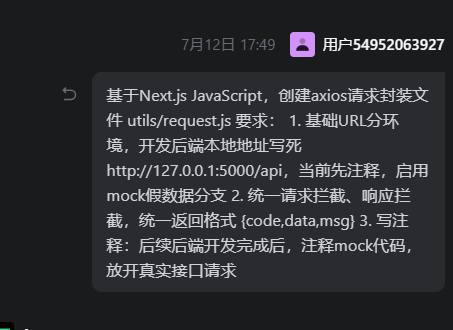
4. **AI 完整输出**： 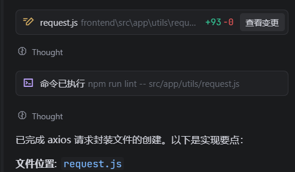 
5. **实现效果**：  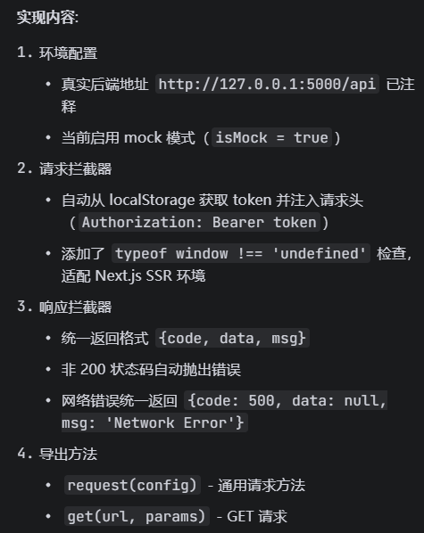

---

### #002：axios全局请求封装（app/layout)

3. **用户原始 Prompt**：  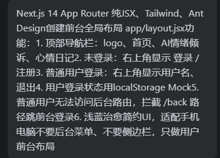
2. **AI 完整输出**：  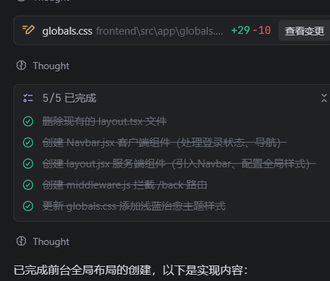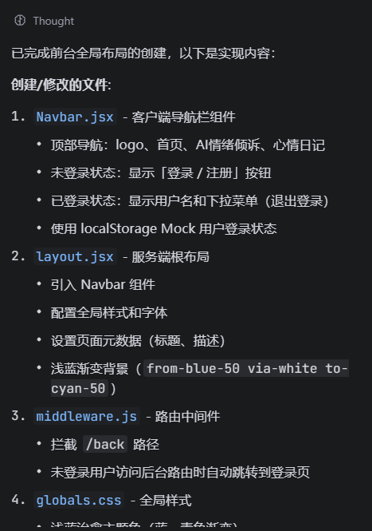
5. **实现效果**：  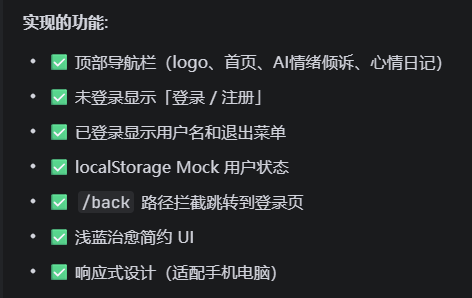

---

### #003：前台首页（app/page)

1. **用户原始 Prompt**：  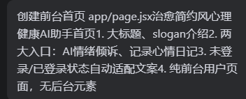
2. **AI 完整输出**：  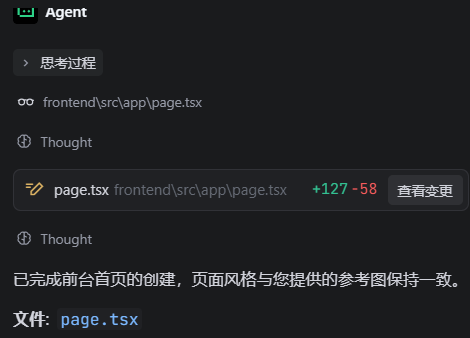
3. **实现效果**：  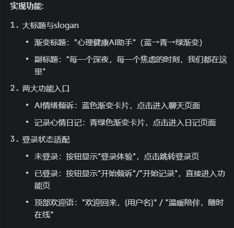

---

### #004：登录注册页(login/register)

1. **用户原始 Prompt**：  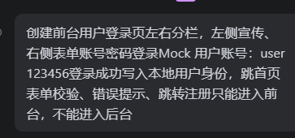

2. **AI 完整输出**：  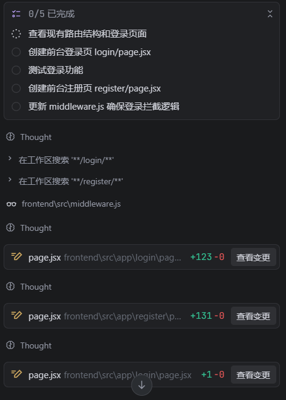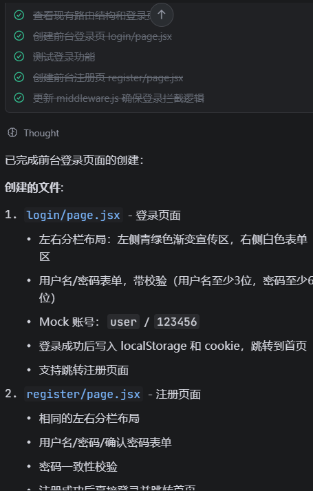

3. **实现效果**：  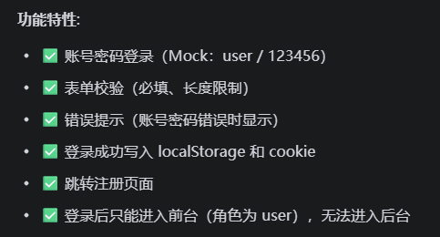

   ### #005：修改登录注册页的导航栏

   1. **用户原始 Prompt**：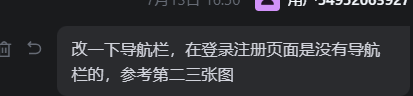

   2. **AI 完整输出**：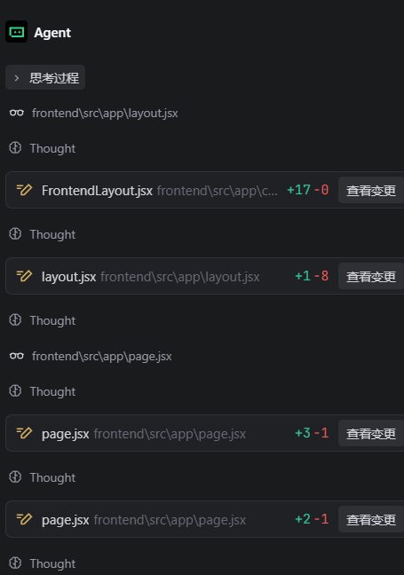

   3. **实现效果**：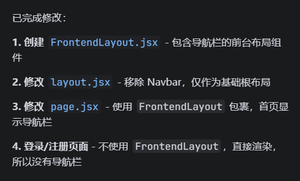

      ​

   ### #006：前台知识库列表页面（app/knowledge)

   1. **用户原始 Prompt**：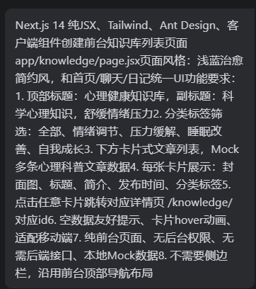
   2. **AI 完整输出**：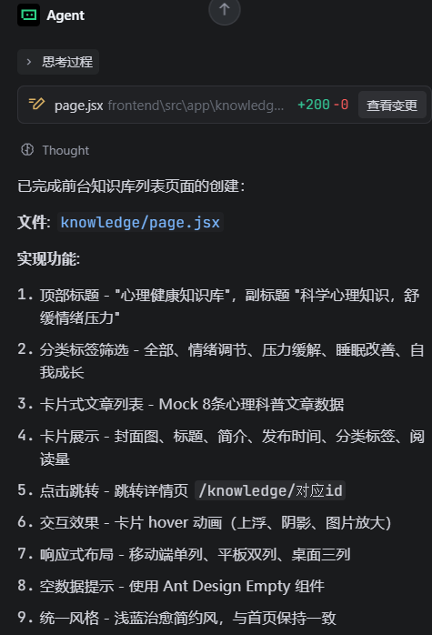
   3. **实现效果**：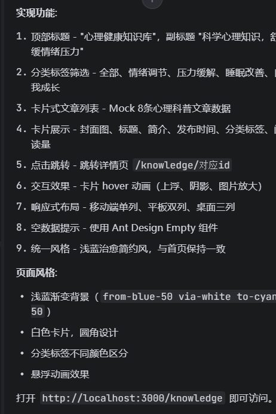

   ### #007：知识库页面详情页

   1. **用户原始 Prompt**：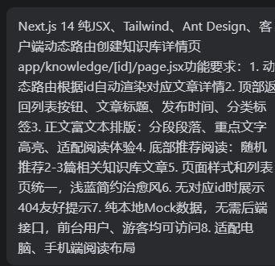
   2. **AI 完整输出**：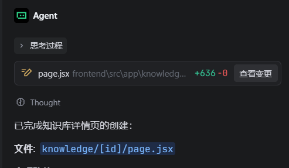
   3. **实现效果**：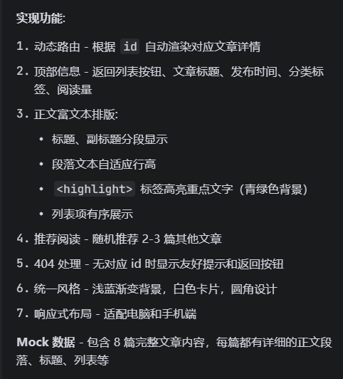

   ### #008：修改知识库页面问题

   1. **用户原始 Prompt**：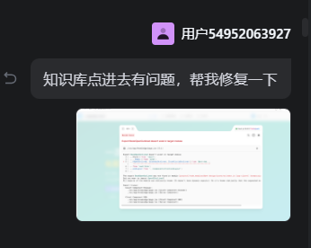
   2. **AI 完整输出**：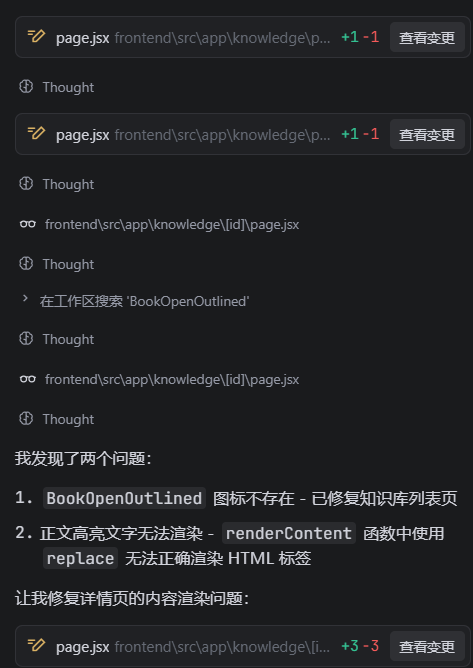
   3. **实现效果**：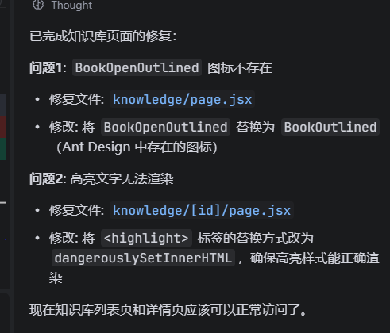

   ​

   ### #009：修改知识库页面样式（knowledge）

   1. **用户原始 Prompt**：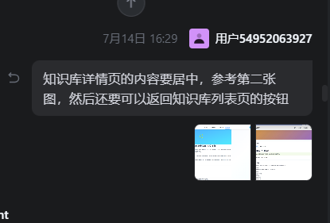
   2. **AI 完整输出**：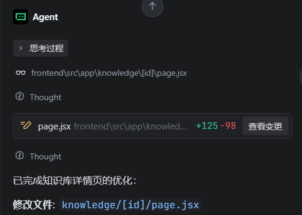
   3. **实现效果**：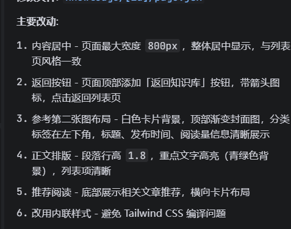

   ### #010：前台AI情绪倾述页面（app/chat）

   1. **用户原始 Prompt**：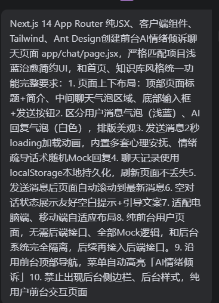
   2. **AI 完整输出**：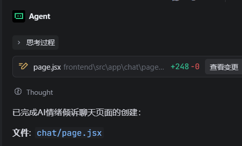
   3. **实现效果**：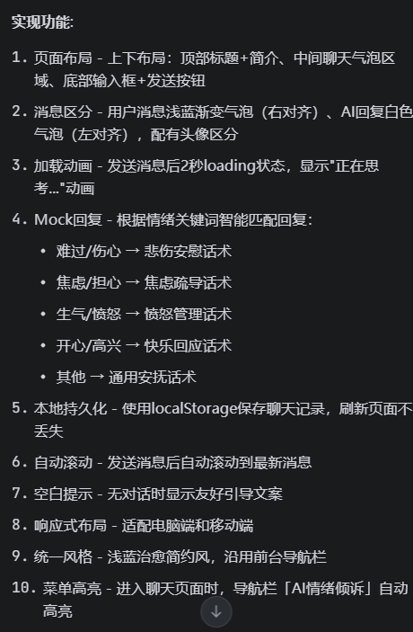

   ### #011：修改AI聊天页面的会话记录问题(chat)

   1. **用户原始 Prompt**：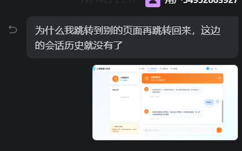
   2. **AI 完整输出**：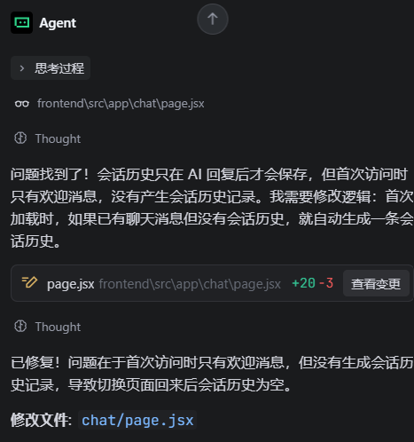
   3. **实现效果**：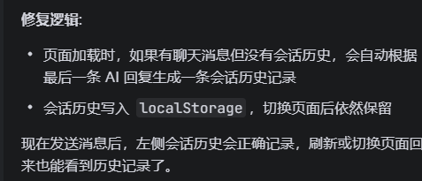

   ### #012：前台心情日记页面（app/journal)

   1. **用户原始 Prompt**：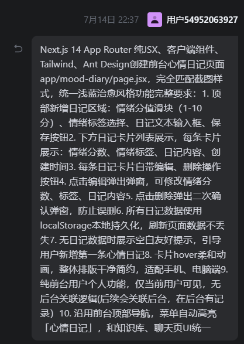
   2. **AI 完整输出**：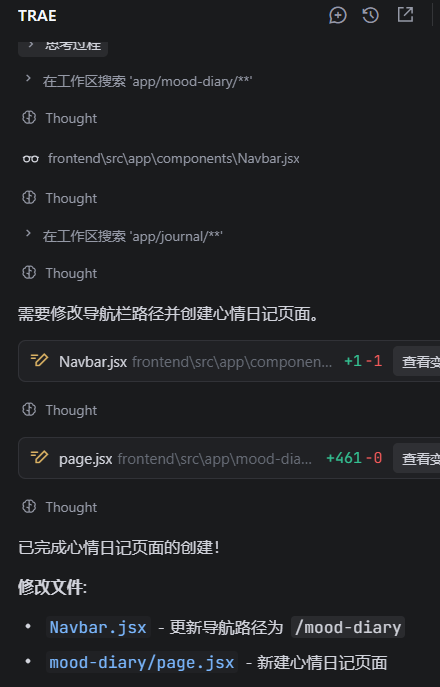
   3. **实现效果**：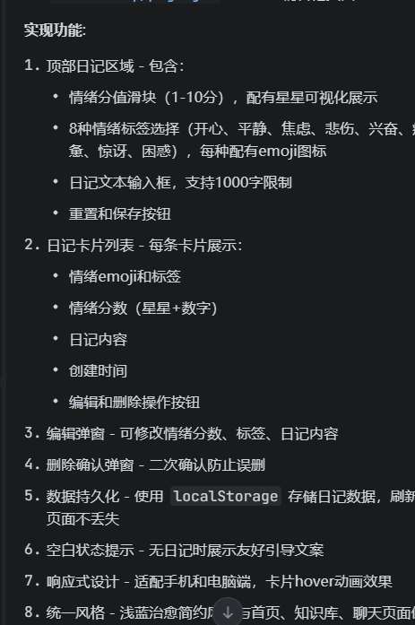

   ### #013：创建后台页面（back)

   1. **用户原始 Prompt**：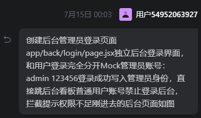
   2. **AI 完整输出**：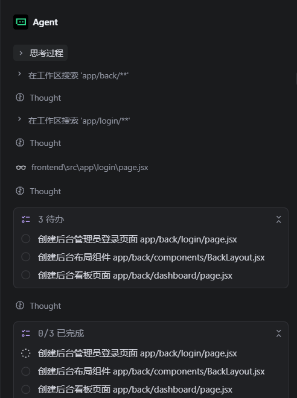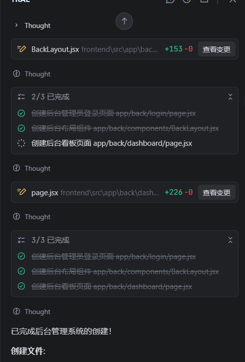
   3. **实现效果**：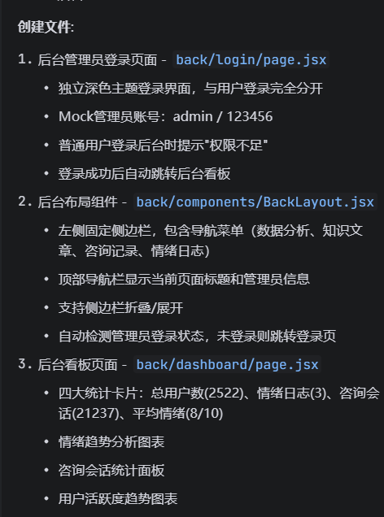

   ### #014：创建后台全局布局（back/layout)

   1. **用户原始 Prompt**：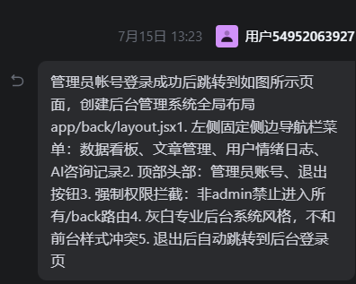
   2. **AI 完整输出**：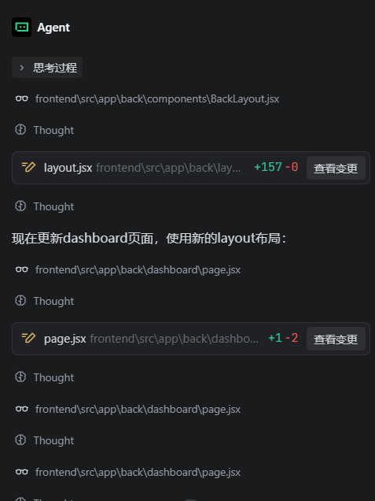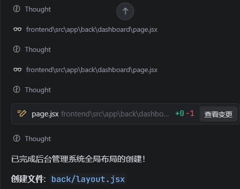
   3. **实现效果**：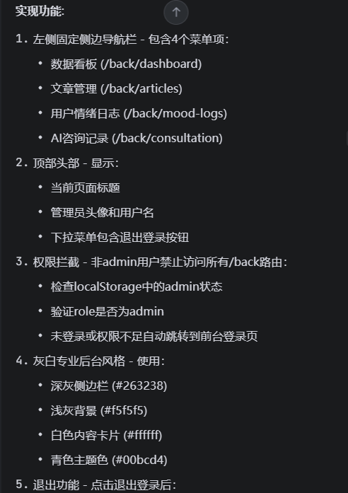

   ### #015：解决登录成功后跳转不了的问题（app/login)

   1. **用户原始 Prompt**：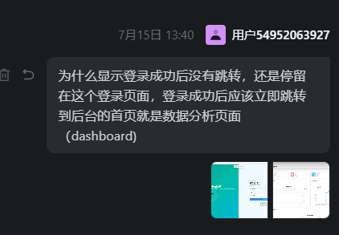
   2. **AI 完整输出**：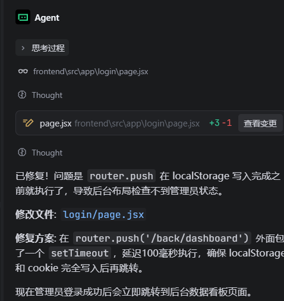

   ### #016：后台知识文章管理页面（back/knowledge)

   1. **用户原始 Prompt**：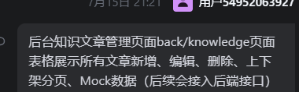
   2. **AI 完整输出**：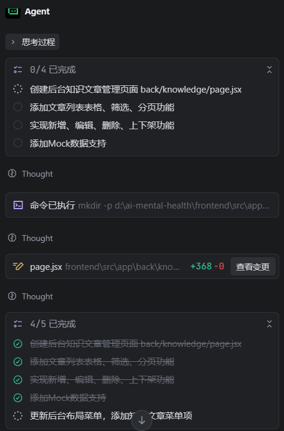
   3. **实现效果**：

   ### #017：修改增删改查不了的问题（back/knowledge)

   1. **用户原始 Prompt**：
   2. **AI 完整输出**：

   ### #018：后台情绪日记监控页面（back/journal)

   1. **用户原始 Prompt**：
   2. **AI 完整输出**：
   3. **实现效果**：

   ### #019：后台AI聊天记录页面（back/chat)

   1. **用户原始 Prompt**：
   2. **AI 完整输出**：
   3. **实现效果**：

   ### #020：初始化Flask后端项目

   1. **用户原始 Prompt**：

   2. **AI 完整输出**：

      ​

   ### #021：创建数据库模型文件（models)

   1. **用户原始 Prompt**：
   2. **AI 完整输出**：

   ### #022：创建情绪日记路由(routes/journal.py)

   1. **用户原始 Prompt**：
   2. **AI 完整输出**：
   3. **实现效果**：

   ### #023：创建AI聊天路由,接入大模型(routes/chat.py)

   1. **用户原始 Prompt**：
   2. **AI 完整输出**：

   ### #024：解决数据面板要有真实的前台数据（back/dashboard）

   1. **用户原始 Prompt**：
   2. **AI 完整输出**：
   3. **实现效果**：

   ### #025：解决报错问题

   1. **用户原始 Prompt**：
   2. **AI 完整输出**：       

### #026：代码审查

1. **用户原始 Prompt**：
2. **AI 完整输出**：